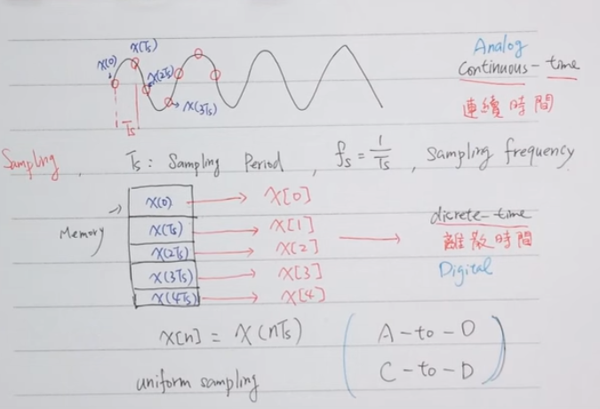
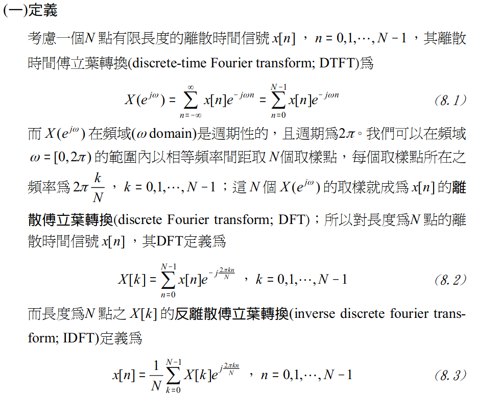
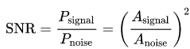
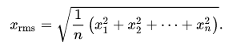
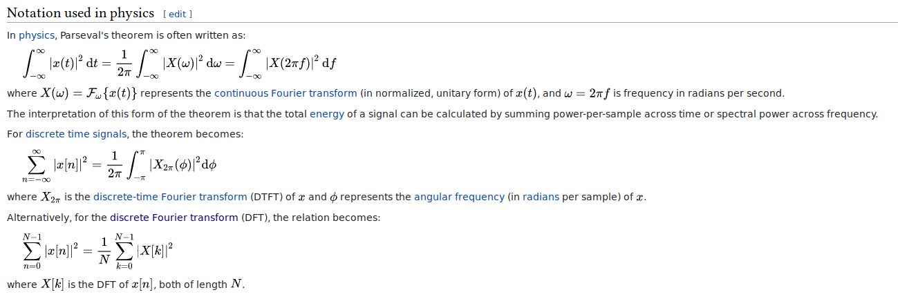

# FFT and SNR

- [Fast Fourier TRansform (FFT)](#fft)
- [Signal-to-noise ratio (SNR)](#snr)

<span id="fft"></span>
## Fast Fourier Transform (FFT)

A `fast Fourier transform (FFT)` is an algorithm that computes the `discrete Fourier transform (DFT)` of a sequence, or its inverse (`IDFT`). 

- complexity of computing: 
    
    `O(nlog(n))`

### Step

```
     sampling                 DFT
x(t) --------> x(kTs) = x[n] -----> X[k]
```

#### 1. Sampling Theorem



#### 2. Discrete Fourier Transform



---
<span id="snr"></span>
## Signal-to-noise ratio (SNR)

`Signal-to-noise ratio (SNR)` is a measure used in `science and engineering` that compares the level of desired `signal` to the level of background `noise`. `SNR` is defined as the ratio of signal power to the noise power, offten experessed in `decibels`.

A ratio higher than 1:1 (greather than 0 dB) indicates more signal than noise.

### Definition



where A is the `root mean square amplitude`.



---
## Parseval's theorem



---
## Ref

1. http://publish.get.com.tw/publish/Control/Pictures/BookPre_pdf/M625A-2.PDF
2. http://wiki.csie.ncku.edu.tw/embedded/ADC/Sampling_Theorem
3. https://en.wikipedia.org/wiki/Signal-to-noise_ratio
4. https://en.wikipedia.org/wiki/Parseval%27s_theorem
