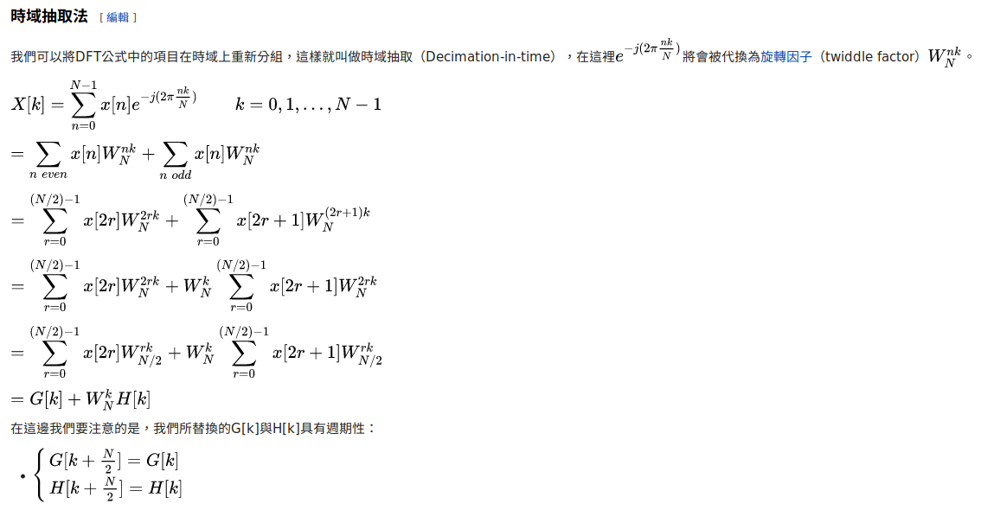
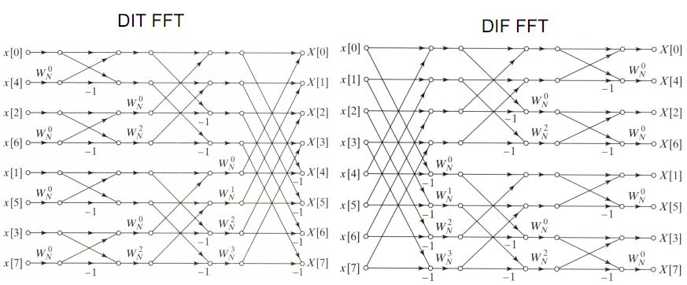
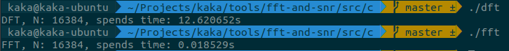
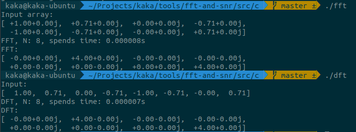

# Cooley-Tukey FFT algorithm

## Formula



## Butterfly diagram

- [Buffterfly diagram](https://en.wikipedia.org/wiki/Butterfly_diagram)



## Usage

1. Compile

    ```bash
    $ make
    ```

2. Run

    ```bash
    # DFT
    $ ./dft

    # FFT
    $ ./fft
    ```

## DFT v.s FFT

1. spends times

    

2. example

    

## Ref

1. https://en.wikipedia.org/wiki/Cooley%E2%80%93Tukey_FFT_algorithm

2. https://zh.wikipedia.org/wiki/%E5%BA%93%E5%88%A9%EF%BC%8D%E5%9B%BE%E5%9F%BA%E5%BF%AB%E9%80%9F%E5%82%85%E9%87%8C%E5%8F%B6%E5%8F%98%E6%8D%A2%E7%AE%97%E6%B3%95

3. https://en.wikipedia.org/wiki/Butterfly_diagram

4. http://www.csie.ntnu.edu.tw/~u91029/Wave.html#4
