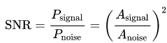
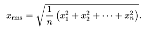
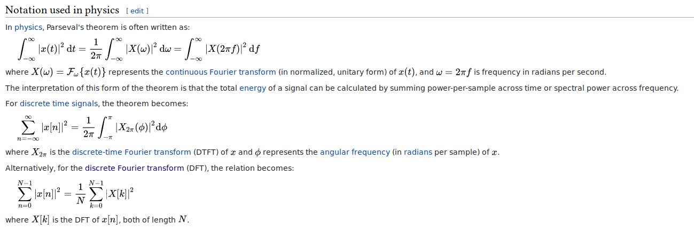

# Signale-to-noise ration(SNR)

`Signal-to-noise ratio (SNR)` is a measure used in `science and engineering` that compares the level of desired `signal` to the level of background `noise`. `SNR` is defined as the ratio of signal power to the noise power, offten experessed in `decibels`.

A ratio higher than 1:1 (greather than 0 dB) indicates more signal than noise.

## Definition

where A is the `root mean square amplitude`.

## Parseval's theorem

According to `Parseval's theorem`, we can use `power in frequency domain` to calculate the `SNR`.

---

## Ref

1. https://en.wikipedia.org/wiki/Signal-to-noise_ratio#Digital_signals
2. https://en.wikipedia.org/wiki/Parseval%27s_theorem
